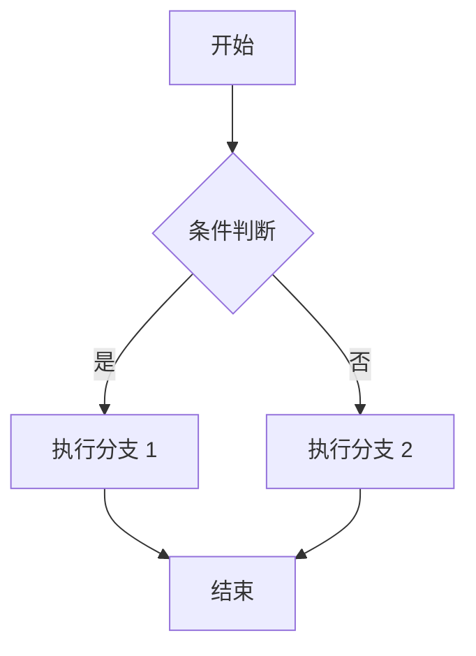
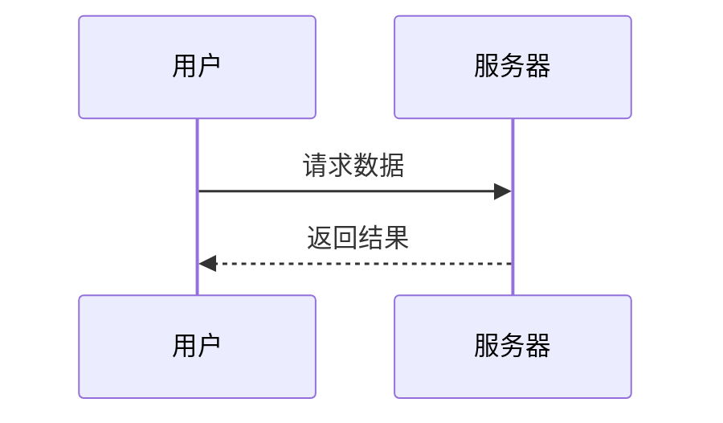

## 1. 行内公式（KaTeX）

时间复杂度 $O(n \log n)$，空间复杂度 $O(1)$；快排平均比较次数约为 $2n \ln n$。

## 2. 块级公式

$$
T(n) = 2T\left(\frac{n}{2}\right) + O(n) = O(n \log n)
$$

## 3. 矩阵与希腊字母

$$
\begin{bmatrix}
a_{11} & a_{12} \\
a_{21} & a_{22}
\end{bmatrix}
\quad \alpha, \beta, \theta, \sum_{i=1}^{n} i = \frac{n(n+1)}{2}
$$

## 4. Mermaid 流程图



## 5. Mermaid 时序图



## 6. 普通代码块（不受影响）

```js
function quickSort(arr) {
  if (arr.length <= 1) return arr;
  const [p, ...rest] = arr;
  return [...quickSort(rest.filter(x => x < p)), p, ...quickSort(rest.filter(x => x >= p))];
}
```